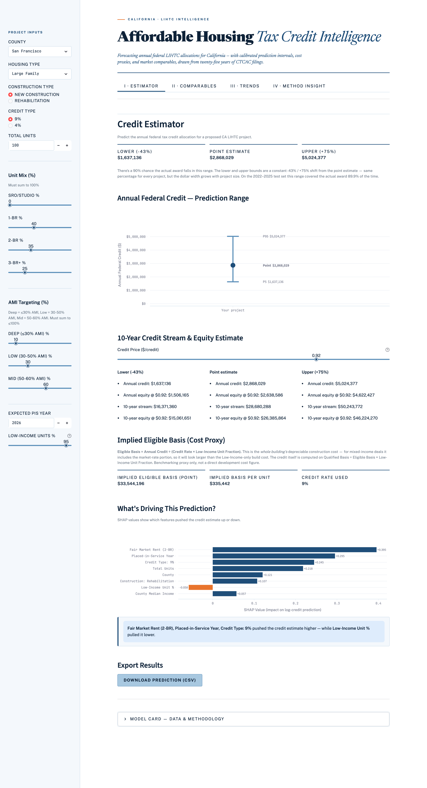
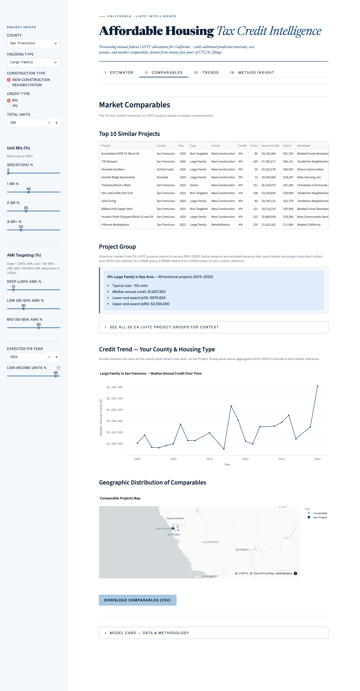
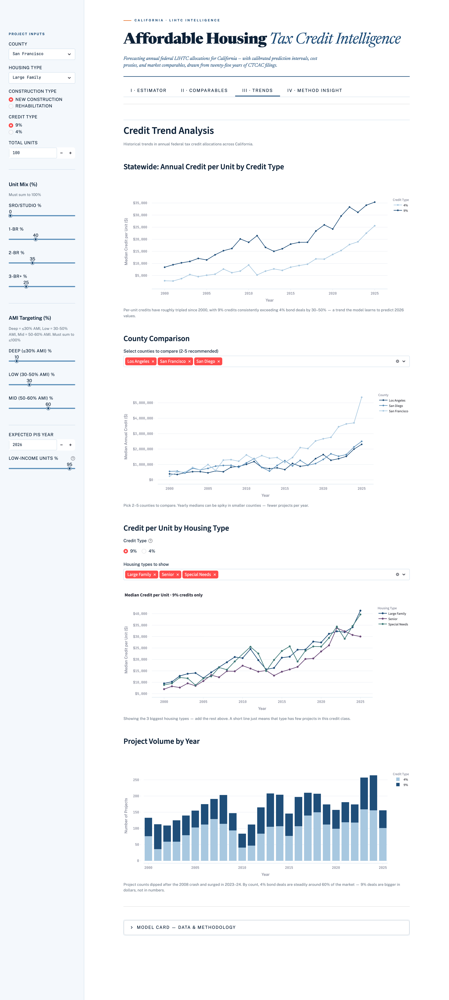
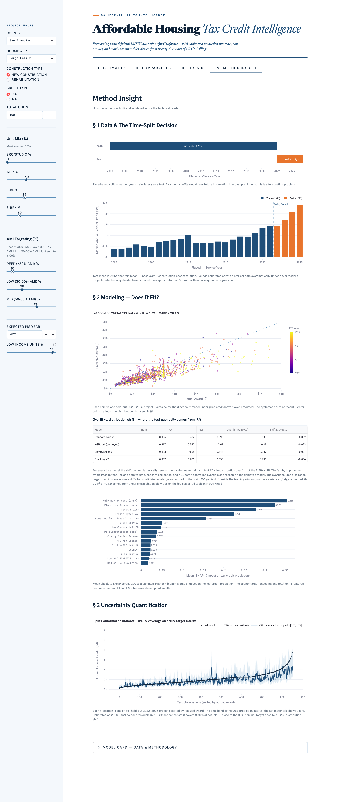
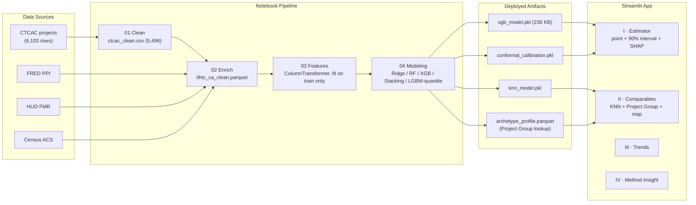

# CA Affordable Housing Tax Credit Intelligence Platform

A data-driven ML platform that predicts **annual federal tax credit allocations** for California Low-Income Housing Tax Credit (LIHTC) projects — with confidence ranges, cost proxies, and market comparables.

> Built for developers, investors, and housing finance agencies who need a data-driven sanity check on credit requests before submitting to CTCAC.

**🔗 Live demo:** [ca-lihtc-intelligence.streamlit.app](https://ca-lihtc-intelligence.streamlit.app)
**📂 Repo:** [github.com/lilhuang15/ca-affordable-housing-tax-credit-intelligence](https://github.com/lilhuang15/ca-affordable-housing-tax-credit-intelligence)



| II · Comparables | III · Trends | IV · Method Insight |
|---|---|---|
|  |  |  |

---

## Highlights

- **R² = 0.62, MAPE = 26 %** on a 2022–2025 holdout that is **2.26× larger in mean** than the 2000–2021 training window — distribution-shift-aware evaluation, not lab-clean metrics
- **90 % prediction interval via log-space split conformal**, calibrated on a 2020–2021 hold-out residual quantile → **89.9 % empirical coverage** on the 2022–2025 test set (multiplicative band `pred × [0.57, 1.75]`, adapts to project size, finite-sample guarantee under exchangeability)
- **Three-stage train / CV / test diagnostic** (NB04 §10a, Tab IV) separates in-distribution overfit from real distribution-shift impact across all 5 candidate models — drove the deployment trade-off (XGBoost over Stacking-v2 despite 0.4 pp MAPE gap on artifact-size and SHAP-latency grounds)
- **ColumnTransformer with cross-fitted TargetEncoder + StandardScaler** for the 50+ county feature — prevents within-training target leakage on the highest-cardinality column; documented bug-fix in NB03 §6 where missing scaler caused KNN cosine similarity to collapse from ~93 % to ~32 % on novel inputs
- **Live Streamlit app** with 4 tabs: per-project estimator (point + interval + SHAP local + 10-year equity), market comparables (KNN + project-group lookup table + geo map), statewide trends (with credit-class filter), methodology walk-through (time-split, distribution shift, actual-vs-predicted, global SHAP, conformal coverage)

---

## What It Does

Given a project's characteristics (county, size, unit mix, credit type, housing type), the platform outputs:

1. **Expected annual federal credit** — XGBoost point estimate + 90% prediction interval (split conformal in log space, displayed as a multiplicative band: pred × [exp(−q̂), exp(+q̂)]; with 90% target coverage the lower/upper bounds correspond to **P5 / P95**)
2. **Implied eligible basis** — a development cost proxy derived from the predicted credit (`credit ÷ (credit rate × low-income unit fraction)`; the LI fraction matters because the credit is computed on Qualified Basis = Eligible Basis × LI fraction)
3. **Market comparables** — the 10 most similar historical CA LIHTC projects
4. **SHAP explanation** — which features drove the prediction and by how much

---

## Results (Test Set: 2022–2025)

### Point Estimate Accuracy

| Model | R² | MAPE | Within 10% |
|---|---|---|---|
| Ridge (baseline) | -0.35 | 44.4% | 18.8% |
| Random Forest | 0.40 | 29.2% | 15.5% |
| **XGBoost** *(deployed)* | **0.62** | **26.1%** | **22.0%** |
| LightGBM p50 (tuned) | 0.55 | 25.7% | 24.6% |
| Stacking v2 (RF + XGB + LGBM-p50 → Ridge meta) | 0.66 | 25.7% | 25.7% |

XGBoost is the **deployed point model**, not Stacking v2. Although the stack is ~0.4pp better on MAPE, the deployment trade-off favors XGBoost: SHAP `TreeExplainer` works natively (precise + millisecond), the artifact is 236 KB vs Stacking's ~80 MB, inference latency is ~3× lower, and bootstrap 95% CIs for MAPE overlap. Stacking v2 is reported as an offline benchmark.

**Validation methodology — three-stage decomposition.** NB04 §10a separates the test-set R² gap into its two root causes: `train − CV` isolates **in-distribution overfit**; `CV − test` isolates **distribution-shift impact** (CV folds span 2000–2021, test is 2022–2025). The diagnostic informed two decisions: (a) the **deployment choice** — XGBoost shows the most controlled overfit profile among tree-based models thanks to `max_depth=3`, while Random Forest's overfit is severe enough to disqualify it independently of shift; (b) the **roadmap** — for every tree-based model the shift gap is small enough (within the ∼0.04 R² bootstrap noise band) that improvement effort should target feature granularity and data volume rather than additional shift-mitigation. Full per-model breakdown in [`docs/Pipeline_Technical_Guide.md` §5e](docs/Pipeline_Technical_Guide.md), and the full train / CV / test table is on the live app's Method Insight tab (visible in the screenshot above).


### Prediction Interval Coverage (target: 90%)

| Method | Coverage | Mean Width |
|---|---|---|
| LightGBM quantile p10–p90 *(offline benchmark)* | 47.8% | $784K |
| **Split conformal on XGBoost — log-space** *(deployed)* | **89.9%** | **$2.12M** (multiplicative: pred × [0.57, 1.75], i.e. −43% / +75%) |

The naive LightGBM quantile model under-covers severely on the 2022–2025 holdout — it was trained on 2000–2021 distributions but the test mean is 2.26× larger (real post-COVID construction cost escalation, not a data issue).

**Split conformal on XGBoost — log-space (multiplicative).** Calibration residuals are computed in log space (the model's training space) on the most recent two training years (2020–2021), held out from the conformal model. The deployed interval is therefore a **multiplicative band** on the dollar prediction:

```
[ pred × exp(−q̂_log),  pred × exp(+q̂_log) ]
= [ pred × multiplier_low,  pred × multiplier_high ]
```

Here **q̂** is a single calibration constant: the 90th-percentile absolute error of the model's log-scale predictions, measured on the held-out 2020–2021 calibration years. Exponentiating ±q̂ turns that error budget into the multiplicative band — currently ×0.57 / ×1.75, i.e. −43% / +75%.

The two multipliers are model-level constants; the **percentage shift is the same for every project**, but the **dollar width adapts to project size** — a $500K project gets a tighter dollar band than a $5M project. This form has two advantages over an additive dollar-space conformal:

1. The lower bound is always non-negative without ad-hoc clipping at $0.
2. It implicitly handles heteroscedasticity — large LIHTC awards have larger absolute residuals, and the multiplicative band naturally widens with prediction size.

Coverage retains the finite-sample guarantee under exchangeability. The conformal band is what the Streamlit app reports as the user-facing P5/P95 (dollar amount + constant percentage shift).

---

## Data Sources

| Source | What | Used For |
|---|---|---|
| [CTCAC Project Database](https://www.treasurer.ca.gov/ctcac/projects.asp) | 6,103 CA LIHTC projects, 1989–2025 | Primary — target variable + all project features |
| [FRED WPUSI012011](https://fred.stlouisfed.org/series/WPUSI012011) | Producer Price Index for construction | Temporal cost environment features |
| [HUD Fair Market Rents](https://www.huduser.gov/portal/datasets/fmr.html) | Annual 2BR FMR by county | Local rent ceiling proxy |
| [Census ACS 5-Year](https://api.census.gov/data/key_signup.html) | County-level income, rent, poverty | Local economic conditions |

---

## Pipeline & Architecture



```
01_data_process.ipynb    →  ctcac_clean.csv         (5,496 rows)
02_enrich_data.ipynb     →  lihtc_ca_clean.parquet  (+ PPI, FMR, Census)
03_feature_engineering.ipynb  →  feature_pipeline.pkl   (ColumnTransformer, fit on train only)
04_modeling.ipynb        →  models/*.pkl + archetype_profile.parquet
                            (Ridge, RF, XGBoost, Stacking, LightGBM, KNN, Project Group GroupBy)
streamlit_app.py         →  interactive demo
```

**Train/test split:** Time-based — train 2000–2021 (3,536 rows), test 2022–2025 (851 rows). No random splitting — this is a temporal prediction problem.

---

## Models

| Model | Role |
|---|---|
| Ridge | Interpretable baseline |
| Random Forest | Non-linear baseline |
| **XGBoost** | **Deployed point estimator** (gradient boosting) |
| Stacking v2 (RF + XGB + LightGBM-p50 → Ridge meta) | Offline benchmark — best raw accuracy |
| LightGBM Quantile (p10/p50/p90, tuned per-quantile, pinball-loss CV) | Offline benchmark — under-covers on shifted test set |
| **Split Conformal on XGBoost** | **Deployed prediction interval** (90% target) |
| KNN (cosine, k=10) | Market comparables retrieval (specific projects) |
| Project Group lookup (`archetype_profile.parquet`, 2015–2025) | Segment-level "what does my project group look like in this market" — deterministic GroupBy on `(credit_type, housing_type, region)` (see note below) |

---

## Feature Engineering Highlights

- **TargetEncoder + StandardScaler** for `county` (50+ unique values) — 5-fold cross-fitting, empirical Bayes smoothing, fit on training split only, **followed by `StandardScaler`**. The trailing scaler is essential: TargetEncoder outputs raw-dollar means ($500K–$2M), a column whose standard deviation (std) is about $250K — while every other scaled column has std = 1. Without the trailing scaler, that one column would be ~250,000× wider than the rest and would dominate every distance-based downstream consumer (KNN cosine, Ridge loss, etc.). Tree models are scale-invariant so the scaler is neutral for them but unifies the contract every consumer sees.
- **OneHotEncoder** for `credit_type`, `construction_type`, `housing_type`, and `region` — region was moved here from TargetEncoder because its 5 categories produced a scalar 71% correlated with county TE (redundant for trees, harmful for Ridge)
- **StandardScaler + median imputation** for 16 numeric features
- **ColumnTransformer fit on training split only** — strict leakage prevention
- **Log-transform target** `log1p(annual_federal_award)` — reduces train skew from 4.31 → -0.28
- **Walk-forward TimeSeriesSplit(n_splits=4)** for hyperparameter tuning, on a `pis_year`-sorted training frame so folds are genuine walk-forward windows

### How the Project Group lookup works

The Streamlit "Project Group" panel in Tab 2 is a deterministic GroupBy on `(credit_type, housing_type, region)` saved as `archetype_profile.parquet`. Each row is one cell with `count`, `median_award`, `p10_award`, `p90_award`, `median_units`, `median_year`. The GroupBy keys are exactly the user's sidebar dropdowns, so the lookup is a single-row join at query time — no model, no `random_state`, no hyperparameter, fully reproducible.

The GroupBy is restricted to **2015–2025 historical projects** (~2,123 of the 4,387 scoped rows) — the modern post-QAP-reform era. Including pre-2015 projects pulled the empirical p10 of populated groups down to a misleading $300–400k floor (driven by 2000–2006 small 10–30 unit deals), which doesn't reflect post-2015 cost realities for users querying 2026 projects. KNN comparables are *not* time-filtered — `pis_year` is one of its 28 features and cosine similarity self-corrects (2026 queries retrieve 2022–2025 neighbors regardless of corpus age, so an explicit filter would just shrink the search pool without changing typical results).

---

## Setup

```bash
# Clone
git clone https://github.com/lilhuang15/ca-affordable-housing-tax-credit-intelligence.git
cd ca-affordable-housing-tax-credit-intelligence

# Install dependencies
pip install -r requirements.txt

# Set Census API key (free signup at api.census.gov)
export CENSUS_API_KEY=your_key_here

# Run pipeline in order (downloads data first — see data sources above)
jupyter nbconvert --to notebook --execute data/01_data_process.ipynb
jupyter nbconvert --to notebook --execute data/02_enrich_data.ipynb
jupyter nbconvert --to notebook --execute data/03_feature_engineering.ipynb
jupyter nbconvert --to notebook --execute data/04_modeling.ipynb

# Launch app
streamlit run streamlit_app.py
```

---

## Repository Structure

```
data/
├── 01_data_process.ipynb          # Clean CTCAC data
├── 02_enrich_data.ipynb           # Join PPI, FMR, Census
├── 03_feature_engineering.ipynb   # Scope filter, train/test split, ColumnTransformer
└── 04_modeling.ipynb              # Train all models, SHAP, save .pkl files

models/
├── feature_pipeline.pkl           # Fitted ColumnTransformer
├── feature_config.pkl             # Feature names and split parameters
├── xgb_model.pkl                  # XGBoost — deployed point estimator
├── conformal_calibration.pkl      # Split-conformal q_hat — deployed interval
├── credit_quantile.pkl            # LightGBM p10/p50/p90 (offline benchmark)
├── knn_model.pkl                  # KNN for comparables
├── archetype_profile.parquet      # Project Group GroupBy table — credit × housing × region, 2015–2025
├── ridge_model.pkl                # Ridge baseline
├── shap_explainer.pkl             # SHAP TreeExplainer for XGBoost
├── train_data.parquet             # Pre-transform train frame (used by app)
├── test_data.parquet              # Pre-transform test frame
├── df_all_scoped.parquet          # Train + test combined (KNN index — must match the order KNN was fit on)
├── X_train.npy / X_test.npy       # Transformed feature arrays
├── y_train.npy / y_test.npy       # Target arrays
└── model_comparison.csv           # Test-set metrics across all models

streamlit_app.py                   # Streamlit demo (Phase 1)
requirements.txt
```

> Large files excluded from git: `data/ctcac_projects.xlsx`, `data/FMR_All_1983_2026.csv`, `models/rf_model.pkl` (~78 MB Random Forest, kept for reproducibility but not loaded by the app). Re-generate by running the notebooks.

---

## Phase 2 (Planned)

An AI Credit Advisor tab using Anthropic tool-calling (`claude-haiku-4-5`) with:
- 4 tools: `predict_credit_amount`, `get_comparables`, `get_construction_index`, `compliance_qa`
- ChromaDB + BM25 hybrid RAG over CTCAC/IRS compliance documents
- Conversation memory and structured citations

---

## Future Work

- **Mondrian (group-conditional) conformal prediction.** The current split-conformal interval is *marginally* calibrated to ~89% across the whole test set, but coverage may vary by subgroup (e.g. 90% in LA County, 70% in rural counties). A Mondrian variant — bucketing by `county`, `region`, or `credit_type` and computing a separate `q_hat` per bucket — would target conditional coverage and is the standard fairness-aware extension. ~20 lines on top of the existing pipeline.
- **Conformalize Stacking v2.** Wrap the Stacking ensemble in the same split-conformal procedure and compare coverage / interval width vs the XGBoost-based version. If the two are close, this is additional evidence that XGBoost is the right deployment choice; if Stacking gives meaningfully tighter intervals at equal coverage, the deployment trade-off (artifact size, latency, SHAP) becomes a sharper conversation.
- **Single distributional model.** Replace the (XGBoost + conformal) + (LightGBM quantile) two-track setup with a single distributional estimator such as CatBoost `MultiQuantile` or NGBoost, which produces coherent multi-quantile output from one model.

---

## Tech Stack

`pandas` · `scikit-learn` · `xgboost` · `lightgbm` · `category_encoders` · `shap` · `plotly` · `streamlit`
